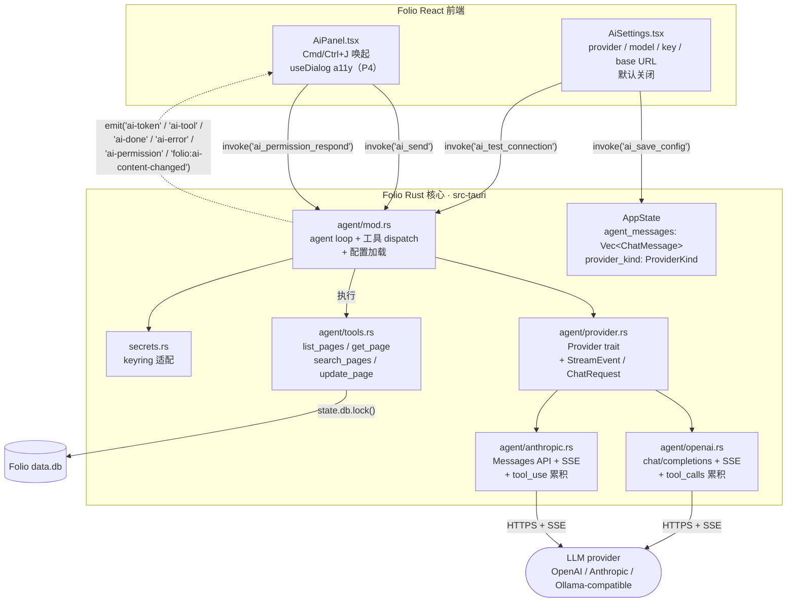

# M10 — AI 助手开发方案（v2：内置 agent）

> **本文为 v2，取代 v1 的 opencode 集成方案。** 决策变更见 §0.5。
>
> **核心变化**：不再 spawn `sst/opencode` 子进程；改为在 Folio Rust 核心
> **内置 agent loop**（`reqwest` 直连 LLM API + 原生 tool calling）。
> 前端 `AiPanel` 事件契约（`ai-token` / `ai-done` / `ai-error` 等）保持不变。

---

## 0. TL;DR

| 项 | 决策 |
|----|------|
| 里程碑 | **M10 — AI 助手**（v2） |
| 目标版本 | **v0.4.0**（0.x 阶段，新功能升 MINOR） |
| 引擎 | **Folio Rust 核心**内置 agent loop（不再依赖外部二进制） |
| LLM 调用 | `reqwest 0.12` + `eventsource-stream 0.2` + `tokio`，Rust 端直连 provider HTTPS |
| Provider | **OpenAI + Anthropic 双原生**（chat/completions + Messages API，各自 SSE streaming + tool calling） |
| 工具调用 | OpenAI `tools/functions` / Anthropic `tool_use`；Rust 端直接函数 dispatch（不走 MCP 协议） |
| 数据访问 | Agent 直接调 `db::list_pages` / `fetch_page_with_doc` / `search` / `update_page_doc`（同步，零跨进程） |
| 唤起 | 应用内 `Cmd/Ctrl+J`（保留，M4 已验证 keydown 路径） |
| 前端事件契约 | **保留**（`ai-token` / `ai-thought` / `ai-tool` / `ai-done` / `ai-error` / `ai-permission`） |
| API key 存储 | 系统钥匙串（`keyring 3` crate，跨平台） |
| AI 定位 | **默认关闭**；用户配 cloud key **或** 接本地模型（Ollama 等 OpenAI-compatible endpoint） |
| 会话历史 | 暂存内存（M10 内不持久化到 data.db）；后续 milestone 评估 |
| 分阶段 | P1 单 provider 通路 → P2 agent loop + 工具 → P3 Settings → P4 产品化 |

**与 v1 相比被删除的复杂度**：无外部二进制依赖、无 ACP/JSON-RPC over stdio、无 MCP server 进程模型、无 XDG/`OPENCODE_CONFIG_*` 隔离环境变量、无 sidecar 打包、无 capabilities shell scope、无 5-7s bootstrap 等待。

---

## 0.5 与 v1（opencode 集成）方案的关键差异

> v1 的实施代码（`opencode.rs` 529 行 + `mcp_server.rs` 307 行）当前堆在
> `feat/m10-p1-minimal-pipeline` 分支工作区，**未提交**。v2 上线前需清理。

| 维度 | v1（opencode） | v2（内置 agent） |
|------|---------------|-----------------|
| AI 引擎 | spawn `sst/opencode` 二进制（MIT） | Rust 内置 `reqwest` + agent loop |
| 进程模型 | 1 个长驻 opencode 子进程 + 1 个 `folio --mcp` 子进程 | 0 个子进程（全在主进程 tokio runtime） |
| 驱动协议 | ACP（JSON-RPC over nd-JSON stdio） | 直接 HTTPS + SSE（`reqwest`） |
| 工具协议 | MCP（JSON-RPC over stdio） | OpenAI / Anthropic 原生 tool calling，Rust 函数 dispatch |
| 数据访问 | spawn `folio --mcp`，opencode 经 stdio 调它，再 `rusqlite` | agent loop 直接 `state.db.lock()` 调 `db::*` |
| 配置注入 | `OPENCODE_CONFIG_CONTENT` + XDG 环境变量 | Rust 端读 `ai_settings` 表 + keyring，构造请求 |
| 实例隔离 | XDG_*_HOME + `OPENCODE_CONFIG_DIR` 重定向 | **不需要**（无外部进程） |
| 二进制分发 | Tauri sidecar（`externalBin`）+ CI 下载重命名 + macOS universal 处理 | **不需要** |
| Capabilities | `shell:allow-spawn` + `stdin-write` + `kill` + `shell:allow-execute`（sidecar scope） | **不需要** shell 权限（HTTPS 走 Rust，不受 webview allowlist 限制） |
| 启动延迟 | 首次 `Cmd/Ctrl+J` 等 5-7s（opencode bootstrap） | 首次请求等 LLM 首 token（典型 0.5-2s） |
| 安装包体积 | +~50MB（opencode 三平台变体） | +~3MB（reqwest + TLS） |
| 退出清理 | `RunEvent::ExitRequested` kill 子进程 | **不需要**（tokio 任务自动取消） |
| 升级路径 | opencode 上游 breaking 风险 | 自己控制 LLM API 兼容 |

**保留不变**：
- §2 里程碑范围（除「opencode 二进制三平台打包」「实例隔离」两项移除）
- §7 Provider 配置存储与 UI 设计（keyring + ai_settings 表 + Settings 面板字段）
- §10 测试策略（除 mock opencode 二进制相关）
- §12 Definition of Done（更新指标，移除 sidecar 相关项）
- 前端 `AiPanel.tsx` 的事件契约和 UI 形态

---

## 1. 已定决策清单（resolved forks）

| Fork | v1 决策 | v2 决策 | 依据 |
|------|---------|---------|------|
| R1 数据访问路径 | MCP 桥接 | **直接函数调用**（agent 持 `AppState` 引用，`db.lock()` 拿连接） | 无跨进程开销，无协议层 |
| R2 云 vs 本地 | opt-in + BYO key | **不变**：默认关闭，BYO key 或本地 OpenAI-compatible endpoint | local-first 原则 |
| R3 双 SQLite | 保持独立 | **不变**：M10 内会话不持久化，仅内存 | 降低复杂度 |
| R4 二进制分发 | sidecar 打包 | **删除**：内置 agent，无需外部二进制 | 决策反转 |
| R5 TipTap keydown | P0 实测通过 | **不变**：`App.tsx:92` 已有 `Cmd/Ctrl+J` 监听（M4 已发布路径） | 代码证据 |
| ~~R6 ACP schema~~ | P0 实测通过 | **作废**：不再用 ACP | — |
| R6' Provider SSE 稳定性 | — | **✅ 调研确认**：OpenAI `data: [DONE]` 哨兵 + Anthropic 命名事件，wire format 稳定多年 | Librarian 调研（2026） |
| R7' 工具调用累积 | — | **OpenAI** 按 `tool_calls[].index` 累积；**Anthropic** 按 `content_block_delta.partial_json` 累积到 `content_block_stop` | 同上 |
| 驱动协议 | ACP | **HTTPS + SSE**（reqwest 直连） | 决策反转 |
| Provider 抽象 | （单家） | **`async_trait` + `BoxStream<Event>`**，原生支持 OpenAI + Anthropic | 用户决策 |
| 工具协议 | MCP | **provider 原生 tool calling**（OpenAI `tools` / Anthropic `tool_use`），Rust 函数 dispatch | 移除协议层 |
| API key 存储 | keyring | **不变**：keyring crate，`ai_settings` 表只存引用 | 安全要求 |
| 实例隔离 | XDG env 组合 | **不需要** | 决策反转 |
| 唤起层级 | app 级 keydown | **不变** | — |
| 前端事件契约 | ai-token 等 7 个 | **保留**（AiPanel.tsx 几乎不动） | 复用现有 370 行 |

> 决策完备性：本表之后，**没有任何阻塞性的「待定」**。

---

## 2. 里程碑范围与边界

### 2.1 In Scope（M10 v2 交付）

- Rust 端 `agent` 模块：provider trait + OpenAI 实现 + Anthropic 实现 + agent loop + 工具 dispatch
- 应用内 `Cmd/Ctrl+J` 唤起 AI 面板（保留）
- LLM token 流式渲染到前端（保留事件契约）
- 多轮对话（会话上下文在内存保持）
- 工具调用：读页面 / 搜页面 / 改页面文档（直接调 `db::*`）
- 写工具审批 UI（`ai-permission` 事件 + Allow/Reject）
- Settings 面板：AI 开关、provider 选择、API key、模型、base URL
- 本地模型支持（OpenAI-compatible endpoint，如 Ollama）
- i18n（`ai` 命名空间，zh-CN + en）
- a11y（AI 面板符合现有 `useDialog()` 规范）
- 错误态全覆盖（无网络 / 坏 key / provider 5xx / 模型不存在）
- API key 脱敏存储（keyring）

### 2.2 Out of Scope（M10 不做）

- ❌ Anthropic prompt caching（后续优化）
- ❌ OpenAI Responses API（继续用经典 Chat Completions，稳定）
- ❌ 流量统计 / 成本仪表盘
- ❌ 会话历史持久化到 `data.db`（R3 延后）
- ❌ OS 级全局快捷键（应用未聚焦也能触发）
- ❌ 多 agent / 多窗口 AI
- ❌ 自定义工具注册（用户不能自己加 tool）
- ❌ 生成内容 diff 视图 / 版本历史对比

### 2.3 非目标（明确不做）

- 不做云中转、不做账号体系、不做遥测。LLM 调用直连用户配置的 provider，
  Folio 不经手 token。与 README「no account, no cloud, no telemetry」一致。

---

## 3. 分阶段交付（P1 → P4）

> v2 删除了 v1 的 P0（ACP 可行性验证）—— 调研已回答所有未知数。
> v2 的 P1+P2 合并了 v1 的 P1+P2+P3（spawn / ACP / MCP），因为内置后复杂度大降。

每阶段对应一个 feature 分支（见 §11）。阶段依赖严格线性。

### 3.1 P1 — Provider trait + 单 provider 通路（OpenAI 对话）

**目标**：跑通最小闭环——前端发消息 → Rust 调 OpenAI → 流式 token 回前端。
**不**碰工具调用、Anthropic、Settings；只用环境变量硬编码 key 做 dev 验证。

| # | 任务 | 文件 | 验收 |
|---|------|------|------|
| P1-1 | 加依赖：`reqwest` (rustls-tls) + `eventsource-stream` + `futures` + `async-trait` | `Cargo.toml` | `cargo build` 通过 |
| P1-2 | 新建 `src-tauri/src/agent/mod.rs`、`provider.rs`、`stream.rs`：定义 `Provider` trait、`ChatRequest`、`ChatMessage`、`StreamEvent`、`ProviderError` 类型 | `agent/*.rs`（新建） | 类型可编译 |
| P1-3 | 新建 `agent/openai.rs`：实现 `Provider` for `OpenaiProvider`（chat/completions + SSE 解析 + `[DONE]` 处理） | `agent/openai.rs` | 单元测试：mock SSE 流 → 解析出 text delta 序列 |
| P1-4 | 新建 `agent/mod.rs` 的 `send_message()` 入口：构造请求 → 调 provider.stream() → 把 `StreamEvent::Delta` emit 为 `ai-token`，结束 emit `ai-done`，错误 emit `ai-error` | `agent/mod.rs` | — |
| P1-5 | `AppState` 删 `opencode` 字段；加 `agent_messages: Arc<Mutex<Vec<ChatMessage>>>`（会话内存） | `lib.rs` | 编译通过 |
| P1-6 | `invoke_handler` 注册 `ai_send` / `ai_stop`（替换 v1 的 `opencode_send/stop`） | `lib.rs` | — |
| P1-7 | `src/lib/invoke.ts` 改 `api.aiSend` / `api.aiStop`；`AiPanel.tsx` 跟着改名（UI 不动） | `invoke.ts`, `AiPanel.tsx` | typecheck 通过 |
| P1-8 | 清理：删 `opencode.rs`、删 `mcp_server.rs`、删 `main.rs` 的 `--mcp` 分支、删 `capabilities/default.json` 的 shell 权限、删 `tauri.conf.json` 的 `externalBin` | 多文件 | 编译 + typecheck 通过 |

**验收（P1 出口）**：在 `~/.folio-ai-dev.env` 放 `OPENAI_API_KEY` → `pnpm tauri dev` → `Cmd/Ctrl+J` → 输入「用一句话介绍你自己」→ 看到流式回复。`pnpm typecheck` 0 错误。

**分支**：`feat/m10-p1-agent-core`

> P1 仅用环境变量做 dev 验证（`OPENAI_API_KEY`），P3 才接 Settings + keyring。

---

### 3.2 P2 — Agent loop + 工具调用 + Anthropic

**目标**：从「单轮 HTTP 调用」升级为完整 agent loop；加入工具调用让 AI 能读写页面；加 Anthropic provider。

| # | 任务 | 文件 | 验收 |
|---|------|------|------|
| P2-1 | 扩 `Provider` trait：加 `tools` / `tool_choice` 字段；`StreamEvent` 加 `ToolCallStart { id, name }` / `ToolCallDelta { id, partial_json }` / `ToolCallEnd { id }` / `Finish { reason }` | `agent/provider.rs` | 类型完备 |
| P2-2 | OpenAI tool calling：请求带 `tools: [...]`；响应解析 `choices[0].delta.tool_calls`（按 `index` 累积 arguments JSON 字符串），`finish_reason == "tool_calls"` 时触发工具 | `agent/openai.rs` | 单元测试：mock 多 chunk tool_call 流 → 累积出完整 args JSON |
| P2-3 | 新建 `agent/anthropic.rs`：实现 `Provider` for `AnthropicProvider`（Messages API + 命名事件 SSE：`message_start` / `content_block_start` / `content_block_delta` / `content_block_stop` / `message_delta` / `message_stop`） | `agent/anthropic.rs` | 单元测试：mock SSE → 解析 text_delta + tool_use + input_json_delta 累积 |
| P2-4 | 新建 `agent/tools.rs`：定义 `Tool` / `ToolSchema` / `ToolCall` / `ToolResult`；注册内置工具 `list_pages` / `get_page` / `search_pages` / `update_page`（实现直接搬 v1 `mcp_server.rs:164-241`，去掉 MCP 协议层） | `agent/tools.rs` | 单元测试：每个工具 mock 调用返回正确结构 |
| P2-5 | Agent loop：在 `send_message()` 里循环——若 `Finish.reason == "tools"` 且有 tool_calls，执行工具 → 把结果作为 `role: "tool"` 消息 push 回 `messages` → 继续调 provider.stream()；直到 `Finish.reason == "stop"` | `agent/mod.rs` | 多轮工具调用闭环 |
| P2-6 | 工具 dispatch 时 emit `ai-tool`（工具名）；写工具（`update_page`）执行前 emit `ai-permission`，**阻塞等** `ai_permission_respond` 命令；写完成后 emit `folio:ai-content-changed`（让编辑器刷新） | `agent/mod.rs`, `lib.rs` | 写工具触发审批弹窗；允许后才执行 |
| P2-7 | 错误处理：provider 4xx（鉴权 / 模型不存在）/ 5xx / 网络断 / 流中断 / JSON 解析失败 → emit `ai-error` 明确文案 | `agent/*.rs` | 故意填错 key，前端显示「API key 无效」而非空白卡死 |
| P2-8 | 切换 Provider：`AppState` 加 `provider_kind: Arc<Mutex<ProviderKind>>`；`ai_send` 根据当前 kind 选 provider 实例 | `lib.rs`, `agent/mod.rs` | 切换 provider 后下次对话生效（P3 接 Settings 后用户可见） |

**验收（P2 出口）**：问「把我最后一篇日记总结一下」→ AI 调 `list_pages` + `get_page` → 回复总结。问「在首页加一段 TODO」→ AI 调 `update_page` → 审批弹窗 → 允许后编辑器实时出现新内容。OpenAI 和 Anthropic 都跑通。

**分支**：`feat/m10-p2-agent-tools`

---

### 3.3 P3 — Settings 面板 + 配置注入 + keyring

**目标**：非技术用户能在 UI 里配完 provider 并使用。

| # | 任务 | 文件 | 验收 |
|---|------|------|------|
| P3-1 | 新建 `ai_settings` 表（key/value）；新增 `db::ai_get_setting` / `ai_set_setting` / `ai_get_all_settings` | `db.rs`, `schema.rs` | migration 幂等 |
| P3-2 | 加 `keyring = "3"` 依赖；封装 `secrets::get_api_key(provider)` / `set_api_key(provider, key)` / `delete_api_key(provider)` | `Cargo.toml`, 新建 `src-tauri/src/secrets.rs` | keyring 失败有 fallback 文案（不崩溃） |
| P3-3 | `invoke_handler` 注册 `ai_get_config` / `ai_save_config` / `ai_test_connection` / `ai_list_models` | `lib.rs` | — |
| P3-4 | 新建 `src/ai/AiSettings.tsx`：AI 开关 toggle、provider select（Anthropic / OpenAI / Ollama / 自定义）、API key password input（仅 cloud）、model select、base URL input（仅 Ollama / 自定义）、测试连接 button、模型列表刷新 | `AiSettings.tsx`（新建） | 接入现有 `SettingsModal`（M9 已有） |
| P3-5 | `ai_send` 改造：每次调用前从 `ai_settings` + keyring 读配置，动态构造 `Provider` 实例（model / base_url / api_key） | `agent/mod.rs` | UI 改配置后下次对话生效 |
| P3-6 | Ollama 适配：provider 选「Ollama」时，base URL 默认 `http://localhost:11434/v1`，模型列表从 `GET /api/tags` 拉；用 OpenAI-compatible 路径（走 `OpenaiProvider`） | `AiSettings.tsx`, `agent/mod.rs` | 接本地 Ollama 跑通对话 |
| P3-7 | 首次引导：AI 默认关；用户首次按 `Cmd/Ctrl+J` 且未配置时，引导去 Settings | `AiPanel.tsx` | 全新用户首次唤起看到引导而非报错 |

**验收（P3 出口）**：全新安装 → 打开 AI Settings → 选 OpenAI 贴 key → 测试连接 → 关闭 Settings → `Cmd/Ctrl+J` → 对话成功。改选 Ollama → 填 base URL → 对话成功。重启 Folio 配置仍在。

**分支**：`feat/m10-p3-settings`

---

### 3.4 P4 — 产品化（i18n + a11y + 错误态 + 性能）

**目标**：达到发版质量，三平台出包。

| # | 任务 | 文件 | 验收 |
|---|------|------|------|
| P4-1 | i18n：新增 `ai` 命名空间，覆盖 AiPanel + AiSettings 全部文案（zh-CN + en）；AiPanel 现有硬编码中文（「AI 助手」「发送」「停止」「允许」「拒绝」「正在启动 AI 引擎…」）全替换 | `src/i18n/locales/*.json`, `AiPanel.tsx`, `AiSettings.tsx` | 切语言文案正确 |
| P4-2 | a11y：AiPanel 接入 `useDialog()`（role=dialog / aria-modal / aria-label / Escape / Tab trap / focus restore / scroll lock），替换内部 ad-hoc Escape keydown | `AiPanel.tsx`, `src/lib/dialog.ts` | 键盘可达 + 屏幕阅读器友好 |
| P4-3 | 错误态分类文案：无网络 / 401 鉴权 / 403 配额 / 404 模型不存在 / 429 限流 / 5xx provider 故障 / 流中断 / 工具被拒绝 / keyring 不可用 | `AiPanel.tsx`, `agent/mod.rs` | 每种错误有明确文案 + 恢复建议 |
| P4-4 | 性能：token 流式渲染不阻塞主线程；AiPanel 用 `requestAnimationFrame` 批量 setState（攒 ~50ms）；长输出（10k+ token）虚拟化 | `AiPanel.tsx` | 10k token 输出滚动 ≥ 30fps |
| P4-5 | 退出清理：agent loop 是 tokio 任务，process exit 时自动 cancel（无需显式 kill）；确认 `ai_stop` 能中断进行中的请求（drop stream） | `agent/mod.rs` | 用户按「停止」立即停止 |
| P4-6 | README：加「What works in M10 — AI Assistant」章节 | `README.md` | 描述能力 + provider 配置 + 隐私说明 |
| P4-7 | 测试：补 agent 单元测试覆盖（mock SSE 流的各种边界：空 delta / 不完整 JSON / 多工具并发 / 重连） | `agent/*.rs` | 覆盖率 ≥ 70% |

**验收（P4 出口）**：全新安装 → 开 AI → 配 provider → 对话 → 让 AI 改一篇笔记 → 全程零报错、零命令行。`pnpm typecheck` 0 错误，`pnpm tauri build` 三平台出包，安装包体积相比 v0.3.x 增幅 ≤ 5MB（不再有 sidecar +50MB）。

**分支**：`feat/m10-p4-polish`（可拆 i18n / a11y / perf 多个 PR）

---

## 4. 架构总览



**关键流向**：
1. 前端 `Cmd/Ctrl+J` → AiPanel → `invoke('ai_send', {message})`
2. Rust `agent::send_message()` 读配置 + 构造 `ChatRequest`
3. 调 `provider.stream(req)` → tokio 任务消费 SSE 流
4. 每个 `StreamEvent::Delta` → `emit('ai-token')`
5. `StreamEvent::ToolCall*` → 累积工具调用；完整后执行
6. 工具是 `update_page`（写）→ 先 `emit('ai-permission')` 阻塞等用户响应
7. 工具结果 push 回 `messages` → 回到步骤 3 继续循环
8. `StreamEvent::Finish { reason: "stop" }` → `emit('ai-done')` 结束

**与 v1 的架构差异**：
- 删除：opencode 子进程框、MCP server 框、Isolation 隔离层框
- 新增：agent 内部 provider 多态（OpenAI / Anthropic）
- 数据访问从「经 MCP stdio 跨进程」改为「直接 `state.db.lock()`」

---

## 5. 关键技术方案细化

### 5.1 Provider trait（核心抽象）

```rust
// src-tauri/src/agent/provider.rs
use async_trait::async_trait;
use futures::stream::BoxStream;
use serde::{Deserialize, Serialize};

#[async_trait]
pub trait Provider: Send + Sync {
    /// Streaming chat completion. The returned stream yields events in order;
    /// the caller is responsible for accumulating tool_call deltas.
    async fn stream<'a>(
        &'a self,
        req: &'a ChatRequest,
    ) -> Result<BoxStream<'a, Result<StreamEvent, ProviderError>>, ProviderError>;
}

/// Provider-agnostic chat request. Provider impls translate this to their
/// own wire format (OpenAI: messages+tools+tool_choice; Anthropic:
/// system+messages+tools+tool_choice).
#[derive(Clone)]
pub struct ChatRequest {
    pub model: String,
    pub messages: Vec<ChatMessage>,      // includes prior tool results
    pub tools: Vec<ToolSchema>,          // empty = no tool calling
    pub tool_choice: ToolChoice,         // Auto / Required / None
    pub max_tokens: u32,
    pub temperature: Option<f32>,
}

/// One message in the conversation. `content` is a vec because Anthropic
/// assistant turns can contain interleaved text + tool_use blocks.
#[derive(Clone, Serialize, Deserialize)]
pub struct ChatMessage {
    pub role: Role,                      // System / User / Assistant / Tool
    pub content: MessageContent,         // Text(String) | Blocks(Vec<TextBlock|ToolUseBlock|ToolResultBlock>)
}

#[derive(Clone)]
pub enum StreamEvent {
    Delta(String),                                // text token (incremental)
    ThoughtDelta(String),                         // reasoning token (Anthropic thinking / OpenAI o1)
    ToolCallStart { id: String, name: String },
    ToolCallDelta { id: String, partial_json: String },
    ToolCallEnd { id: String },
    Finish { reason: FinishReason, usage: Option<Usage> },
    Error(ProviderError),
}

#[derive(Debug, thiserror::Error)]
pub enum ProviderError {
    #[error("auth failed (HTTP {status}): {body}")]
    Auth { status: u16, body: String },
    #[error("rate limited (HTTP 429): {body}")]
    RateLimited { body: String },
    #[error("provider error (HTTP {status}): {body}")]
    Api { status: u16, body: String },
    #[error("network: {0}")]
    Network(#[from] reqwest::Error),
    #[error("stream invalid: {0}")]
    Stream(String),
    #[error("config: {0}")]
    Config(String),
}
```

> **为什么 `BoxStream` 而不是 `impl Trait`**：trait 方法返回 `impl Trait` 不稳
> 定（RPITITP）；`Pin<Box<dyn Stream + Send>>` 是当前 Rust 稳定的标准做法。
> `async_trait` 处理 `async fn` 在 trait 里的稳定性问题。

### 5.2 SSE 解析（`reqwest` + `eventsource-stream`）

```rust
// src-tauri/src/agent/stream.rs
use eventsource_stream::Eventsource;
use futures::StreamExt;

pub async fn sse_stream(
    client: &reqwest::Client,
    url: &str,
    headers: reqwest::header::HeaderMap,
    body: serde_json::Value,
) -> Result<impl futures::Stream<Item = Result<eventsource_stream::Event, std::io::Error>>, reqwest::Error> {
    let resp = client
        .post(url)
        .headers(headers)
        .json(&body)
        .send()
        .await?
        .error_for_status()?;
    Ok(resp.bytes_stream().eventsource())
}
```

> **crate 选择理由**：`eventsource-stream 0.2` 是纯 SSE 解码器（无 HTTP），
> 叠在 `reqwest::Response::bytes_stream()` 上是 Rust 生态最稳定的组合。
> `reqwest-sse` 把 HTTP + SSE 绑死，遇到 LLM 边界情况（如 Anthropic 的
> `event: ping` 心跳）不好定制。`async-sse` 维护停滞。

### 5.3 OpenAI 实现要点

**请求构造**（`agent/openai.rs`）：
```rust
let body = json!({
    "model": req.model,
    "messages": req.messages.iter().map(openai_msg).collect::<Vec<_>>(),
    "stream": true,
    "stream_options": { "include_usage": true },   // 最后一个 chunk 带 usage
    "tools": req.tools.iter().map(openai_tool).collect::<Vec<_>>(),
    "tool_choice": match req.tool_choice { ... },
    "max_tokens": req.max_tokens,
    "temperature": req.temperature.unwrap_or(1.0),
});
```

**SSE 解析要点**：
- 每个 `data: {json}` → 解析 `choices[0].delta`
- `delta.content` 非空 → emit `StreamEvent::Delta(text)`
- `delta.tool_calls` 数组：每个元素有 `index`（区分多个并发工具调用），
  首个 chunk 含 `id` + `function.name`，后续 chunk 只含 `function.arguments`
  增量字符串 → 按 `index` 累积到 `HashMap<u32, ToolCallAccumulator>`
- `choices[0].finish_reason == "tool_calls"` → flush 所有累积的工具调用
  （emit `ToolCallEnd` for each）→ emit `Finish { reason: "tools" }`
- `choices[0].finish_reason == "stop"` → emit `Finish { reason: "stop" }`
- `data: [DONE]` → 流结束（Anthropic 没有，靠 `message_stop` event）

### 5.4 Anthropic 实现要点

**请求构造**（`agent/anthropic.rs`）：
```rust
let body = json!({
    "model": req.model,
    "max_tokens": req.max_tokens,
    "system": extract_system_prompt(&req.messages),    // Anthropic: system 顶级
    "messages": anthropic_messages(&req.messages),     // 不含 system
    "stream": true,
    "tools": req.tools.iter().map(anthropic_tool).collect::<Vec<_>>(),
    "tool_choice": match req.tool_choice { ... },
});
// Headers: x-api-key + anthropic-version: 2023-06-01
```

**SSE 解析要点**（命名事件流）：
- `event: message_start` → 记录 message id（用于后续 `usage`）
- `event: content_block_start` + `content_block.type == "text"` → 新建文本块
- `event: content_block_start` + `content_block.type == "tool_use"` → emit
  `ToolCallStart { id: block.id, name: block.name }`，建累积器
- `event: content_block_delta` + `delta.type == "text_delta"` → emit
  `StreamEvent::Delta(delta.text)`
- `event: content_block_delta` + `delta.type == "input_json_delta"` → emit
  `ToolCallDelta { id, partial_json: delta.partial_json }`，累积器 append
- `event: content_block_delta` + `delta.type == "thinking_delta"` → emit
  `StreamEvent::ThoughtDelta(delta.thinking)`
- `event: content_block_stop` → 若是 tool_use 块，emit `ToolCallEnd`
- `event: message_delta` → 含 `stop_reason`（`end_turn` / `tool_use` / `max_tokens`）
- `event: message_stop` → emit `Finish { reason: ... }`

> **Anthropic 关键坑**：`input_json_delta.partial_json` 单独看不是合法 JSON
> （如 `{"location":"San` 或 ` Francisco"}`），必须累积到 `content_block_stop`
> 后整体 `serde_json::from_str`。某些模型启用了 `eager_input_streaming`，
> 即使累积完也可能拿到不完整 JSON —— 解析失败时把原始字符串塞进
> `ToolResult` 让模型自己修复。

### 5.5 Agent loop

```rust
// src-tauri/src/agent/mod.rs
pub async fn send_message(app: &AppHandle, state: &State<'_, AppState>, user_msg: String) -> Result<(), String> {
    let config = load_config(state)?;
    let provider = build_provider(&config)?;            // OpenAI | Anthropic | Ollama

    // Push user message into conversation memory
    state.agent_messages.lock().push(ChatMessage::user(user_msg));

    let max_iterations = 10;                              // 防失控循环
    for _ in 0..max_iterations {
        let req = ChatRequest {
            model: config.model.clone(),
            messages: state.agent_messages.lock().clone(),
            tools: tools::all_schemas(),
            tool_choice: ToolChoice::Auto,
            max_tokens: config.max_tokens.unwrap_or(4096),
            temperature: config.temperature,
        };

        let mut stream = provider.stream(&req).await.map_err(|e| e.to_string())?;
        let mut assistant_blocks = Vec::new();
        let mut tool_calls = Vec::new();
        let mut finish_reason = FinishReason::Stop;

        while let Some(ev) = stream.next().await {
            match ev.map_err(|e| e.to_string())? {
                StreamEvent::Delta(t) => { let _ = app.emit("ai-token", t); assistant_blocks.push(Block::Text(t)); }
                StreamEvent::ThoughtDelta(t) => { let _ = app.emit("ai-thought", t); }
                StreamEvent::ToolCallStart { id, name } => {
                    let _ = app.emit("ai-tool", name.clone());
                    tool_calls.push(ToolCallAccumulator::new(id, name));
                }
                StreamEvent::ToolCallDelta { id, partial_json } => {
                    tool_calls.iter_mut().find(|c| c.id == id).unwrap().json_buf.push_str(&partial_json);
                }
                StreamEvent::ToolCallEnd { id: _ } => {}
                StreamEvent::Finish { reason, usage } => {
                    finish_reason = reason;
                    if let Some(u) = usage { let _ = app.emit("ai-usage", u); }
                }
                StreamEvent::Error(e) => { let _ = app.emit("ai-error", e.to_string()); return Err(e.to_string()); }
            }
        }

        // Push assistant turn into memory (text + tool_use blocks)
        state.agent_messages.lock().push(ChatMessage::assistant(assistant_blocks, &tool_calls));

        if finish_reason != FinishReason::Tools || tool_calls.is_empty() {
            let _ = app.emit("ai-done", ());
            return Ok(());
        }

        // Execute tool calls sequentially; results go back as tool messages
        for call in &tool_calls {
            let result = if tools::is_write_tool(&call.name) {
                let _ = app.emit("ai-permission", json!({ "title": format!("允许 AI 调用 {}", call.name), "description": call.args_preview() }));
                wait_for_permission(state).await?          // blocks until user responds
            } else { true };

            if !result {
                state.agent_messages.lock().push(ChatMessage::tool_result(&call.id, "user rejected"));
                continue;
            }

            let output = tools::dispatch(&call.name, &call.parse_args()?, state).await?;
            state.agent_messages.lock().push(ChatMessage::tool_result(&call.id, &output));
            if tools::is_write_tool(&call.name) {
                let _ = app.emit("folio:ai-content-changed", ());   // 让编辑器刷新
            }
        }
        // loop continues → next provider.stream() call
    }

    let _ = app.emit("ai-error", "agent loop exceeded max iterations (10)");
    Ok(())
}
```

> **并发 / 重入处理**：用 `AppState.agent_busy: Arc<Mutex<bool>>` 守门，
> `ai_send` 进入时若 busy=true 则返回 Err，前端 send 按钮也 disable。
> 不需要像 v1 那样管理子进程生命周期。

### 5.6 工具 dispatch（取代 MCP）

```rust
// src-tauri/src/agent/tools.rs
pub async fn dispatch(name: &str, args: &Value, state: &State<'_, AppState>) -> Result<String, String> {
    let conn = state.db.lock();
    match name {
        "list_pages" => tool_list_pages(&conn, args),
        "get_page" => tool_get_page(&conn, args),
        "search_pages" => tool_search_pages(&conn, args),
        "update_page" => tool_update_page(&conn, args, state),   // 内部自动 snapshot
        _ => Err(format!("unknown tool: {name}")),
    }
}
```

工具实现直接搬 v1 `mcp_server.rs:164-241`，**删除** JSON-RPC 信封和
`fn run()` 主循环；保留 `extract_text` / `collect_text` 辅助函数和
`crate::import::markdown::convert` 调用。

---

## 6. ~~opencode 二进制打包方案~~（v2 删除）

> v2 不再需要外部二进制。整节作废。
>
> **清理动作**（P1-8）：
> - 删 `src-tauri/tauri.conf.json` 的 `bundle.externalBin`
> - 删 `src-tauri/capabilities/default.json` 的 `shell:allow-spawn` / `allow-stdin-write` / `allow-kill`
> - 删 `.github/workflows/release.yml` 里若有的「fetch & rename opencode binary」步骤（v1 未实施）
> - 不需要 `src-tauri/binaries/` 目录
> - 安装包体积相比 v0.3.x 增幅仅来自 reqwest + TLS（~3MB），远低于 v1 的 +50MB

---

## 7. Provider 配置与本地模型支持

### 7.1 配置存储（沿用 v1 设计）

```sql
CREATE TABLE IF NOT EXISTS ai_settings (
    key   TEXT PRIMARY KEY,
    value TEXT NOT NULL
);
-- 行示例：
-- ('enabled', 'false')
-- ('provider', 'openai')              -- openai | anthropic | ollama | custom
-- ('api_key_ref', 'keyring:openai')   -- 只存引用，真值在 keyring
-- ('model', 'gpt-4o-mini')
-- ('base_url', '')                    -- 仅 ollama / custom 用
-- ('max_tokens', '4096')
-- ('temperature', '1.0')
```

### 7.2 keyring 封装

```rust
// src-tauri/src/secrets.rs
const SERVICE: &str = "tech.guyuemochen.folio.ai";

pub fn get_api_key(provider: &str) -> Result<Option<String>, String> {
    match keyring::Entry::new(SERVICE, provider).get_password() {
        Ok(k) => Ok(Some(k)),
        Err(keyring::Error::NoEntry) => Ok(None),
        Err(e) => Err(format!("keyring get failed: {e}")),
    }
}

pub fn set_api_key(provider: &str, key: &str) -> Result<(), String> { /* ... */ }
pub fn delete_api_key(provider: &str) -> Result<(), String> { /* ... */ }
```

> **keyring 失败处理**：Linux 上若无 D-Bus / gnome-keyring，`keyring` 会
> 返回错误。Folio 不崩溃 —— emit `ai-error` 提示「无法访问钥匙串，请检查
> 系统密钥环服务」，并允许用户降级到 base64 编码的受限文件（`0600`）。
> 该 fallback 在 P3 实现。

### 7.3 Settings UI（沿用 v1）

| 字段 | 控件 | 说明 |
|------|------|------|
| 启用 AI | toggle | 默认 off |
| Provider | select | OpenAI / Anthropic / Ollama / 自定义 |
| API Key | password input | 仅 OpenAI / Anthropic 显示；存 keyring |
| Model | select / input | OpenAI/Anthropic 列常用模型；Ollama 从 `GET /api/tags` 拉 |
| Base URL | input | 仅 Ollama / 自定义显示；Ollama 默认 `http://localhost:11434/v1` |
| Max Tokens | number input | 默认 4096 |
| Temperature | slider | 0.0 - 2.0，默认 1.0 |
| 测试连接 | button | 发一个最小请求（「hi」，max_tokens=10）验证配置 |

### 7.4 Ollama 适配

Ollama 的 `/v1/chat/completions` 端点完全 OpenAI-compatible，所以
`OpenaiProvider` 直接复用，只是 base_url 改为 `http://localhost:11434/v1`。
模型列表走非 OpenAI 路径：`GET /api/tags`（Ollama 原生），返回
`{ models: [{ name: "llama3.1:latest" }, ...] }`。

### 7.5 隐私边界（与 README 一致）

- LLM 流量从 Folio Rust 端**直连**用户配的 provider，**不经**任何 Folio 服务
- API key 存系统 keyring，**不**进 `data.db`、**不**进配置文件明文
- 对话内容不持久化（M10 内），重启 Folio 后清空
- 工具调用结果（页面内容）会作为 LLM 上下文发送给 provider —— 这是有意为之，
  Settings 面板有明确说明：「调用工具时，被读的页面内容会发送给 LLM provider」

---

## 8. 文件级改动清单

| 文件 | 改动 | 阶段 |
|------|------|------|
| `src-tauri/Cargo.toml` | 加 `reqwest = { version = "0.12", features = ["json", "stream", "rustls-tls"], default-features = false }`、`eventsource-stream = "0.2"`、`futures = "0.3"`、`async-trait = "0.1"`、`keyring = "3"` | P1 / P3 |
| `src-tauri/src/agent/mod.rs` | **新建** — agent loop 主入口 + `send_message()` | P1 |
| `src-tauri/src/agent/provider.rs` | **新建** — Provider trait + 共享类型 | P1 |
| `src-tauri/src/agent/stream.rs` | **新建** — SSE 流辅助（`reqwest` + `eventsource-stream`） | P1 |
| `src-tauri/src/agent/openai.rs` | **新建** — OpenAI 实现（chat/completions + tool_calls） | P1（无 tool）/ P2（加 tool） |
| `src-tauri/src/agent/anthropic.rs` | **新建** — Anthropic 实现（Messages + tool_use） | P2 |
| `src-tauri/src/agent/tools.rs` | **新建** — 工具注册 + dispatch（实现搬自 v1 mcp_server.rs） | P2 |
| `src-tauri/src/secrets.rs` | **新建** — keyring 封装 | P3 |
| `src-tauri/src/opencode.rs` | **删除**（v1，529 行） | P1-8 |
| `src-tauri/src/mcp_server.rs` | **删除**（v1，307 行；工具实现搬到 `agent/tools.rs`） | P1-8 / P2-4 |
| `src-tauri/src/lib.rs` | `AppState` 删 `opencode` 字段，加 `agent_messages` / `provider_kind` / `agent_busy`；`invoke_handler` 改注册 `ai_send` / `ai_stop` / `ai_permission_respond` / `ai_get_config` / `ai_save_config` / `ai_test_connection` / `ai_list_models`；删 `RunEvent` kill 子进程逻辑（无子进程） | P1 → P3 |
| `src-tauri/src/main.rs` | 删 `--mcp` re-entry 分支（v1 残留） | P1-8 |
| `src-tauri/src/db.rs` | 加 `ai_get_setting` / `ai_set_setting` / `ai_get_all_settings`（P3） | P3 |
| `src-tauri/src/schema.rs` | 加 `ai_settings` 表 CREATE 语句 | P3 |
| `src-tauri/capabilities/default.json` | 删 `shell:allow-spawn` / `allow-stdin-write` / `allow-kill`（v1 残留） | P1-8 |
| `src-tauri/tauri.conf.json` | 删 `bundle.externalBin`（v1 残留） | P1-8 |
| `.github/workflows/release.yml` | 无改动（v1 未实施 fetch & rename） | — |
| `src/lib/invoke.ts` | 改 `opencodeSend/Stop/PermissionRespond` → `aiSend/Stop/PermissionRespond`；加 `aiGetConfig/SaveConfig/TestConnection/ListModels` | P1 / P3 |
| `src/ai/AiPanel.tsx` | **几乎不动**（事件契约保留）— 仅改 invoke 命令名；硬编码中文 → i18n（P4）；接入 `useDialog`（P4） | P1 / P4 |
| `src/ai/AiSettings.tsx` | **新建** — provider 配置 UI | P3 |
| `src/i18n/locales/zh-CN.json` | 新增 `ai` 命名空间 | P4 |
| `src/i18n/locales/en.json` | 新增 `ai` 命名空间 | P4 |
| `docs/m10-acp-schema.md` | **作废**（v1 产出，可删可留作历史） | — |
| `docs/ai-assistant-opencode-exploration.md` | **作废**（v1 探索文档） | — |
| `docs/m10-ai-assistant-plan.md` | **本文档**（v2） | — |
| `README.md` | 加「What works in M10 — AI Assistant」章节 | P4 |

---

## 9. 风险缓解矩阵

| 风险 | 概率 | 影响 | 缓解 | 退路 |
|------|------|------|------|------|
| Provider SSE 格式异常（边界 chunk） | 中 | 高 | 单元测试 mock 各种 SSE 流；累积器容忍部分 JSON | emit `ai-error`，丢一个 turn 不崩 |
| Anthropic `eager_input_streaming` 导致 JSON 解析失败 | 中 | 中 | 累积到 `content_block_stop` 再解析；解析失败把原文塞回模型 | 模型自修复 |
| LLM 调用阻塞 tokio runtime | 低 | 高 | `provider.stream()` 在 `tokio::spawn` 任务里跑，不阻塞 invoke handler | — |
| keyring 不可用（Linux 无 D-Bus） | 中 | 中 | P3 实现 file fallback（`0600`） | 受限文件 |
| 用户填错 base URL 导致连不上 | 中 | 低 | `ai_test_connection` 提前探测；错误文案明确（DNS / 拒绝 / 超时分类） | — |
| token 流阻塞前端 | 中 | 中 | Rust 端不节流；前端用 `requestAnimationFrame` 批量 setState | 虚拟化长输出 |
| agent loop 失控（工具反复调用） | 低 | 中 | 硬上限 10 iterations | emit `ai-error` 终止 |
| 写工具误删数据 | 中 | 高 | P2-6 审批 UI + Folio 现有 snapshot/历史可回滚 | 历史版本恢复 |
| Anthropic prompt caching 不支持（成本高） | 确定 | 低 | M10 不做，后续 milestone 评估 | — |
| provider 上游 breaking | 低 | 中 | 锁定具体 API 版本（`anthropic-version: 2023-06-01`）；监控兼容性 | 发版修复 |
| API key 误推到 git | 低 | 高 | 只存 keyring，**禁**写入任何 repo 内文件；`.gitignore` 不覆盖此情况（本就不该有） | 强制审计 |

---

## 10. 测试策略

### 10.1 单元测试（Rust）

- `agent/stream.rs`：mock SSE 字节流（含半行 / 跨 chunk 边界 / 空行 / `event: ping`）→ 解析正确
- `agent/openai.rs`：mock chat/completions SSE（text delta / tool_call 多 chunk 累积 / `[DONE]`）→ 正确 emit `StreamEvent` 序列
- `agent/anthropic.rs`：mock Messages SSE（`message_start` / `content_block_start` text+tool_use / `input_json_delta` 累积 / `message_stop`）→ 正确 emit 序列
- `agent/tools.rs`：每个工具 mock 调用返回正确结构（用 `tempfile::tempdir()` 建临时 db）

### 10.2 集成测试

- 真实 OpenAI / Anthropic API（CI 用 `OPENAI_API_KEY` / `ANTHROPIC_API_KEY` secret，可跳过）：跑一轮对话，验证 token 流
- 端到端：MCP 工具调用 `list_pages` + `get_page` → 真实 db → 模型回复包含页面内容

### 10.3 手动 QA 清单（每阶段出口）

- **P1**：`Cmd/Ctrl+J` 三种焦点场景（编辑器/数据库/输入框）都唤起；发消息有流式回复
- **P2**：「总结最后一篇日记」命中 `get_page`；「在首页加 TODO」走审批后实时反映到编辑器；OpenAI 和 Anthropic 都跑通
- **P3**：全新用户首次引导；Ollama 本地模型跑通；切 provider 后下次对话生效；重启 Folio 配置仍在
- **P4**：切语言文案正确；键盘可达 + 屏幕阅读器友好；10k token 输出不卡；每种错误态文案明确

### 10.4 性能基线

- 首 token 延迟：≤ 2s（OpenAI / Anthropic 典型）
- token 流式：10k token 输出，前端滚动 ≥ 30fps
- AI 面板唤起：< 100ms（lazy chunk 不计入冷启动）
- 工具调用（`get_page`）：< 50ms（本地 SQLite）

### 10.5 不做的事

- 不 mock LLM 网络层做集成测试（成本高、价值低）；集成测试用真 API，CI 可跳过

---

## 11. Git 工作流（遵循 AGENTS.md）

> **重要**：v1 的 `feat/m10-p1-minimal-pipeline` 分支当前堆了未提交的
> opencode 集成代码。**v2 启动前**先把该分支的改动处理掉（要么 squash
> 一个 `feat(ai): scaffold opencode integration (v1, superseded)` 提交留
> 作历史，要么直接 reset 丢弃 —— 推荐前者，保留可追溯性）。

所有 v2 工作从 `dev` 拉，合回 `dev`（PR）。

| 阶段 | 分支 | 合并目标 |
|------|------|---------|
| P1 | `feat/m10-p1-agent-core` | dev |
| P2 | `feat/m10-p2-agent-tools` | dev |
| P3 | `feat/m10-p3-settings` | dev |
| P4 | `feat/m10-p4-i18n` / `feat/m10-p4-a11y` / `feat/m10-p4-perf` | dev |

**提交信息示例**（Conventional Commits，AGENTS.md §5）：

```
feat(ai): scaffold built-in agent module with Provider trait
feat(ai): implement OpenAI streaming provider (chat/completions)
feat(ai): wire agent loop with tool dispatch
feat(ai): implement Anthropic Messages provider with tool_use
feat(ai): add Settings UI with keyring-backed API key storage
feat(ai): wire i18n ai namespace for panel and settings
feat(ai): adopt useDialog for AI panel a11y
chore(ai): remove v1 opencode integration code
```

**版本**（AGENTS.md §6）：
- M10 各阶段合入 dev 不打 tag
- 全部完成后 dev → master PR，标题 `release: v0.4.0`
- 合并后打 `v0.4.0`（annotated tag），触发 stable 构建

---

## 12. Definition of Done（M10 v2 出口）

全部满足才算 M10 完成：

- [ ] P1 单 provider 通路跑通（OpenAI 流式对话）
- [ ] P2 Agent loop + 工具调用闭环（读页面 + 改页面）
- [ ] P2 OpenAI + Anthropic 双 provider 都跑通
- [ ] P2 写工具审批 UI 正常工作
- [ ] `Cmd/Ctrl+J` 在编辑器/数据库/输入框三种焦点下都能唤起
- [ ] P3 Settings 面板：开关 + provider + key + model + base URL + 测试连接
- [ ] P3 Ollama 本地模型跑通（OpenAI-compatible 路径）
- [ ] P3 重启 Folio 后配置持久
- [ ] P4 i18n（zh-CN + en）覆盖 `ai` 命名空间
- [ ] P4 AI 面板走 `useDialog()` a11y 规范
- [ ] P4 错误态全覆盖（无网络 / 坏 key / provider 5xx / 模型不存在 / keyring 不可用 / 流中断）
- [ ] P4 性能基线达标（首 token < 2s，10k token 流式 30fps）
- [ ] `pnpm typecheck` 0 错误，`pnpm tauri build` 三平台出包
- [ ] README 加「What works in M10 — AI Assistant」章节
- [ ] dev → master PR 合并，打 `v0.4.0` tag
- [ ] 安装包体积相比 v0.3.x 增幅 ≤ 5MB

---

## 13. 立即行动项

1. **处理 v1 残留分支**：决定 `feat/m10-p1-minimal-pipeline` 的 11 个 modified + 5 个 untracked 是 squash 提交保留历史，还是 reset 丢弃
2. **开 `feat/m10-p1-agent-core` 分支**，按 §3.1 执行 P1-1 到 P1-8
3. P1 通过后开 P2 分支
4. 每个 PR 描述链接本文，写明「改了什么 / 为什么 / 如何验证」（AGENTS.md §2.1）

> 本方案是 decision-complete 的：§1 之后无阻塞性待定项。

---

## 附录 A：v1 → v2 决策反转的动机

v1 方案 spawn `sst/opencode` 的代价在实施过程中逐渐暴露：

1. **打包复杂**：三平台 sidecar 变体、CI 下载重命名、macOS universal 处理、
   opencode 上游版本钉死与升级维护 —— 全是机械负担，无产品价值
2. **启动延迟**：opencode bootstrap 5-7s（config 探测 + LSP 初始化 + 
   Server.listen），首次 `Cmd/Ctrl+J` 用户必须盯着 loading
3. **协议层冗余**：Folio → ACP → opencode → MCP → `folio --mcp` → SQLite，
   四跳；其中 ACP 和 MCP 各自的 schema、错误处理、累积逻辑都要 Folio 实现
4. **隔离负担**：必须用 XDG env 切断 opencode 读用户全局配置 —— 这本身
   证明 opencode 不是为「嵌入式」设计的
5. **依赖外部项目节奏**：opencode breaking change、ACP schema 变动、
   license 变更，Folio 都被动跟随

v2 内置 agent 的代价：

1. **自己实现 LLM 调用**：reqwest + SSE 解析 + tool calling 累积，~500 行
   Rust（P1+P2 范围）—— 一次性投入，可控
2. **不能复用 opencode 的能力**：agent loop、工具审批 UI、context 管理、
   多模型路由 —— 但 M10 范围内只需要最基础的能力，复杂路由留给后续 milestone

净评估：v2 的总工作量低于 v1 剩余的 P4（打包 + 配置注入 + 实例隔离），
且产物质量、启动速度、安装包体积都显著更优。
